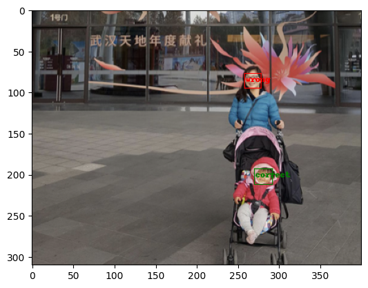
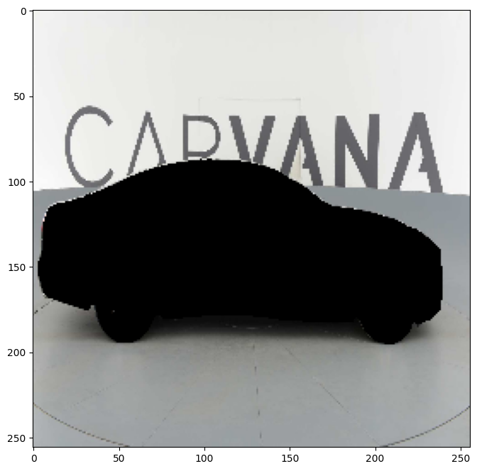

# My DL projects

## Computer Vision

### Flowers Recognition
[Code](khl/DLProjects/blob/main/FlowersRecognition.ipynb)

This is a multi-class classification problem from [Kaggle](https://www.kaggle.com/datasets/alxmamaev/flowers-recognition).
Based on the image of the flower, you need to determine the name of the flower.

To solve this problem, fine tuning of the resnet50 model was used.
Accuracy on test (dataset is balanced): 0.99

Here is an example of how a trained neural network works:

### Face Mask Detection
[solution using FasterRCNN](https://github.com/gitmskhl/DLProjects/blob/main/FaceMaskDetectionFasterRCNN.ipynb) and [solution using YOLOv8](https://github.com/gitmskhl/DLProjects/blob/main/FaceMaskDetectionYOLO.ipynb)

It is necessary to detect people’s faces from photographs and classify them into 3 groups:
1. Those who wear a mask
2. Those who wear a mask incorrectly
3. Those who don't wear a mask

Problem taken from a [Kaggle competition](https://www.kaggle.com/datasets/andrewmvd/face-mask-detection/data)

To solve the problem, 2 models were used: FasterRCNN and YOLO.

Here is an example of the trained model(Faster RCNN) working

This [notebook](https://github.com/gitmskhl/DLProjects/blob/main/FaceMaskDetectionYOLO.ipynb)  allows you to run detection via a webcam in real time. YOLO model used.

### Vehicle segmentation
[code](https://github.com/gitmskhl/DLProjects/blob/main/CarSegmentation.ipynb)
Based on the image of the car, it is necessary to carry out semantic segmentation into 2 classes: car and background.

U-NET model is used. 
Here is an example of how a trained network works

- [Flowers Recognition](khl/DLProjects/blob/main/FlowersRecognition.ipynb)
    - The implementation of it
- [Car Segmentation](https://github.com/gitmskhl/DLProjects/blob/main/CarSegmentation.ipynb)

 

