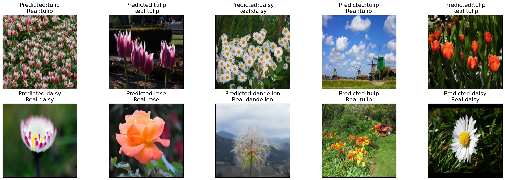

# My DL projects

## Computer Vision

### Flowers Recognition
[Code](khl/DLProjects/blob/main/FlowersRecognition.ipynb)

This is a multi-class classification problem from [Kaggle](https://www.kaggle.com/datasets/alxmamaev/flowers-recognition).
Based on the image of the flower, you need to determine the name of the flower.

- [Flowers Recognition](khl/DLProjects/blob/main/FlowersRecognition.ipynb)
    - The implementation of it
- [Car Segmentation](https://github.com/gitmskhl/DLProjects/blob/main/CarSegmentation.ipynb)

 

